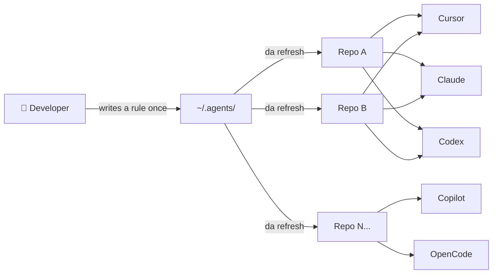

# dot-agents — One-Minute Overview

> **Audience:** anyone seeing dot-agents for the first time.
> **Read time:** 60 seconds. **For the full demo:** [`DEMO_DIAGRAM.md`](./DEMO_DIAGRAM.md).

---

## What it is

**`dot-agents`** is a CLI + canonical config layout that turns the loose
collection of AI coding-agent configs in your home dir into a single,
governable source of truth — and gives those agents a structured operating
loop instead of ad-hoc chat sessions.



You edit **one** file in `~/.agents/`. Every project, every agent picks it up.

## What it solves

| Today | With dot-agents |
|---|---|
| Cursor wants `.cursor/rules/`, Claude wants `CLAUDE.md`, Codex wants `AGENTS.md`, Copilot wants `.github/` — you maintain N copies. | One canonical home; the CLI projects it into the right shape per platform. |
| Every session re-explains yesterday's work | `da workflow orient` resumes from canonical state in seconds. |
| Agents rediscover what's broken every session | Verification state + checkpoints persist in repo. |
| No safe way to run parallel agents | Bounded `workflow fanout` with explicit write scopes + structured merge-back. |
| Tribal knowledge stays tribal | Knowledge graph (`da kg`) captures decisions, entities, code structure. |
| Agents can't improve their own setup | `da review` queues agent-authored proposals for human approval. |

## What's in the box

- **`da` CLI** — Go binary; `init`, `add`, `refresh`, `doctor`, `install`,
  `status`, plus the workflow surface (`workflow orient`, `workflow next`,
  `workflow fanout`, `workflow merge-back`, `workflow delegation closeout`,
  `workflow fold-back`).
- **Canonical resources** — `rules/`, `skills/`, `agents/`, `hooks/`, `mcp/`,
  `settings/` under `~/.agents/`, with per-resource subcommands following the
  contract in [`RESOURCE_COMMAND_CONTRACT.md`](./RESOURCE_COMMAND_CONTRACT.md).
- **Five platforms supported** — Cursor, Claude Code, Codex CLI, GitHub
  Copilot, OpenCode. See [`PLATFORM_DIRS_DOCS.md`](./PLATFORM_DIRS_DOCS.md).
- **Knowledge graph (`da kg`)** — structured notes + code graph for
  agent-friendly memory recall. See
  [`KNOWLEDGE_GRAPH_SUBPROJECT_SPEC.md`](./KNOWLEDGE_GRAPH_SUBPROJECT_SPEC.md).
- **Workflow primitives** — canonical plans, tasks, slices, checkpoints,
  verification logs, fanout/merge-back, fold-back, proposal review. Full
  design in [`LOOP_ORCHESTRATION_SPEC.md`](./LOOP_ORCHESTRATION_SPEC.md).

## Try it in 90 seconds

```bash
# 1. Install (assumes Go 1.24+)
go install ./cmd/da
# installs the `da` binary onto your Go bin PATH

# 2. Initialize the canonical home
da init

# 3. Adopt a project
cd ~/code/my-repo
da add .

# 4. Verify links + see what's projected
da status
da doctor

# 5. Inspect available concepts
da explain
da explain manifest
da explain structure
```

## Where to go next

- **Live demo?** → [`DEMO_DIAGRAM.md`](./DEMO_DIAGRAM.md) (two diagrams, talk
  tracks, 5-minute script).
- **End-to-end workflow example?** → [`DEMO_WORKFLOW_WALKTHROUGH.md`](./DEMO_WORKFLOW_WALKTHROUGH.md).
- **"Does it actually work in practice?"** → [`DEMO_LESSONS_NARRATIVE.md`](./DEMO_LESSONS_NARRATIVE.md).
- **Full demo material index** → [`DEMO_INDEX.md`](./DEMO_INDEX.md).
- **Designing for it / contributing** → [`LOOP_ORCHESTRATION_SPEC.md`](./LOOP_ORCHESTRATION_SPEC.md) and
  [`WORKFLOW_AUTOMATION_PRODUCT_SPEC.md`](./WORKFLOW_AUTOMATION_PRODUCT_SPEC.md).

---

*dot-agents is the substrate. Your rules, skills, and plans are the product.*
