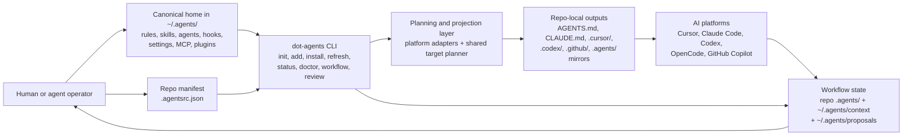
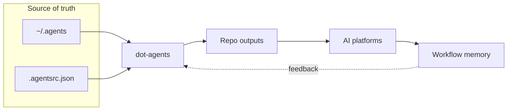
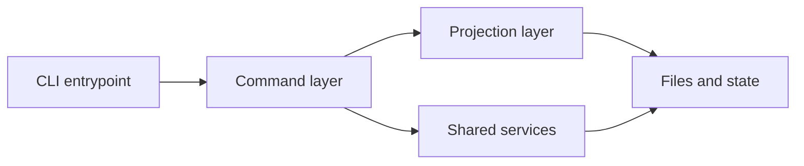

# Project Diagrams

These diagrams are derived from the current repo docs and code structure, primarily:

- `README.md`
- `docs/WORKFLOW_AUTOMATION_PRODUCT_SPEC.md`
- `docs/LOOP_ORCHESTRATION_SPEC.md`
- `docs/PLUGIN_CONTRACT.md`
- `docs/CANONICAL_HOOKS_DESIGN.md`
- `commands/root.go`
- `internal/platform/`

Use the first diagram when you want to explain the product in a demo. Use the second when you want to explain how the current codebase is organized.

## 1. Demo Diagram: How dot-agents works



### Talk track

- `dot-agents` keeps one canonical source of truth in `~/.agents/` instead of hand-managing each platform separately.
- A repo-level `.agentsrc.json` declares what a project needs.
- The CLI reads canonical resources plus the manifest, plans the right outputs per platform, and projects them into the repo with links or rendered files.
- The AI tools consume those repo-local files natively.
- The workflow layer feeds context back through repo-local `.agents/` artifacts and user-local checkpoints and proposals.

## 2. Current Architecture Diagram

```mermaid
flowchart TB
    main["cmd/dot-agents/main.go<br/>Cobra entrypoint"]
    root["commands/root.go<br/>global flags + command registration"]

    subgraph Commands["commands/"]
        core["Project lifecycle<br/>init, add, remove, refresh, import, install"]
        ops["Inspection and ops<br/>status, doctor, explain, sync"]
        wf["Workflow and review<br/>workflow, review, kg"]
        authoring["Authoring<br/>skills, agents, hooks"]
    end

    subgraph Services["internal/"]
        cfg["config<br/>~/.agents config, .agentsrc.json,<br/>paths, proposal metadata"]
        plat["platform<br/>platform adapters, resource intents,<br/>shared target plans, renderers"]
        links["links<br/>symlink and hard-link helpers"]
        ps["projectsync<br/>repo scaffolding, restore helpers,<br/>refresh metadata"]
        hooks["scaffold/hooks<br/>canonical hook bundle assets"]
        graph["graphstore<br/>KG/CRG storage and MCP surfaces"]
        ui["ui<br/>terminal formatting and prompts"]
    end

    subgraph State["Filesystem and state"]
        home["~/.agents/<br/>canonical user-level storage"]
        repo["Managed repo outputs<br/>AGENTS.md, CLAUDE.md, .cursor/,<br/>.codex/, .github/, .opencode/"]
        wfstate["Repo workflow artifacts<br/>.agents/active, .agents/history,<br/>.agents/lessons, workflow plans"]
        kg["Graph state<br/>.code-review-graph and graph backends"]
    end

    main --> root
    root --> core
    root --> ops
    root --> wf
    root --> authoring

    core --> cfg
    core --> plat
    core --> ps

    ops --> cfg
    ops --> plat
    ops --> ui

    wf --> cfg
    wf --> graph
    wf --> ui

    authoring --> cfg
    authoring --> plat
    authoring --> hooks

    plat --> links
    cfg --> home
    plat --> repo
    ps --> repo
    wf --> wfstate
    graph --> kg
```

### Reading notes

- The CLI entrypoint is thin: `cmd/dot-agents/main.go` hands off to Cobra commands in `commands/`.
- `commands/` is the orchestration layer; most reusable behavior lives in `internal/`.
- `internal/platform` is the key projection layer. It knows platform adapters, shared-target intents, and how repo-local outputs get created.
- `internal/config` owns the user-level and repo-level configuration contracts.
- Workflow and knowledge-graph features are layered beside the core config-management path, not bolted into a separate binary.

## Practical use

- For a live demo, show diagram 1 first and narrate the operator story from left to right.
- For maintainers or contributors, switch to diagram 2 and explain the split between `commands/`, `internal/`, and filesystem state.
- If you need slide art later, these Mermaid blocks can be rendered directly in GitHub or copied into Mermaid Live and exported as SVG.

## 3. Slide-Friendly Demo Diagram

This version uses tighter labels and a cleaner presentation flow for demos.



### Presenter note

- `~/.agents` is the shared source of truth.
- `.agentsrc.json` tells each repo what to install.
- `dot-agents` projects that into repo-native files.
- The platforms use those files directly.
- Workflow memory closes the loop so the next session starts with context instead of guesswork.

## 4. Slide-Friendly Current Architecture Diagram

This version is intended for architecture slides where the audience only needs the major layers.



### Presenter note

- The binary entrypoint is thin.
- The command layer handles user-facing workflows.
- The projection layer turns canonical resources into platform-specific repo outputs.
- Shared services handle config, links, hooks, graph access, and project sync.
- Everything ultimately resolves into filesystem state that the tools and agents consume.
