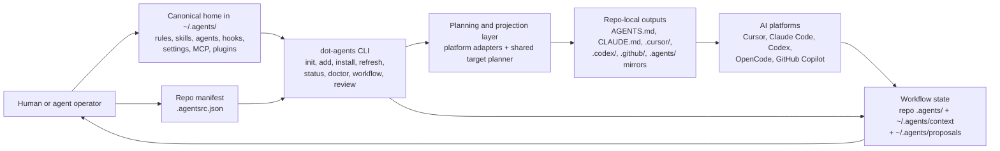
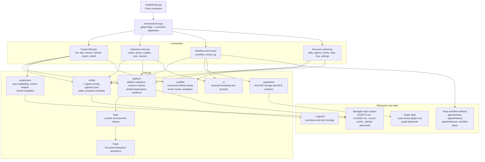
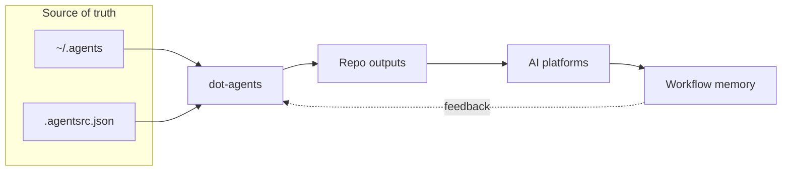
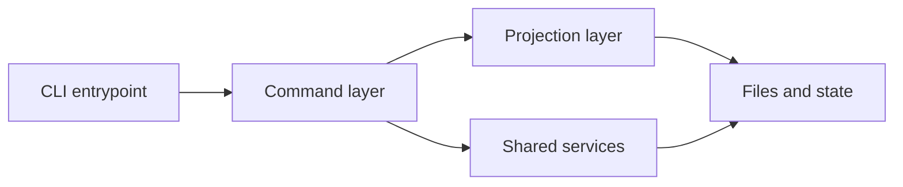
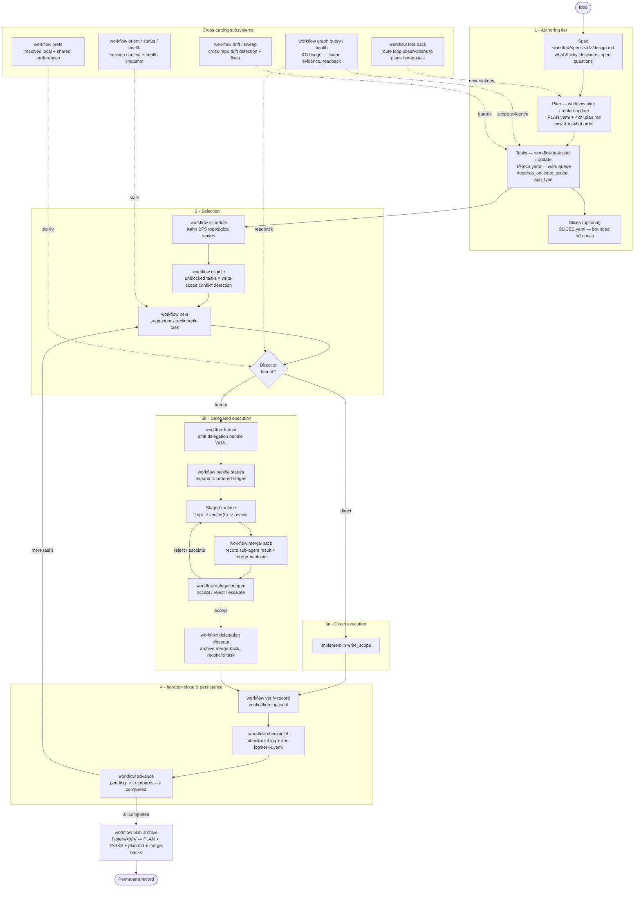
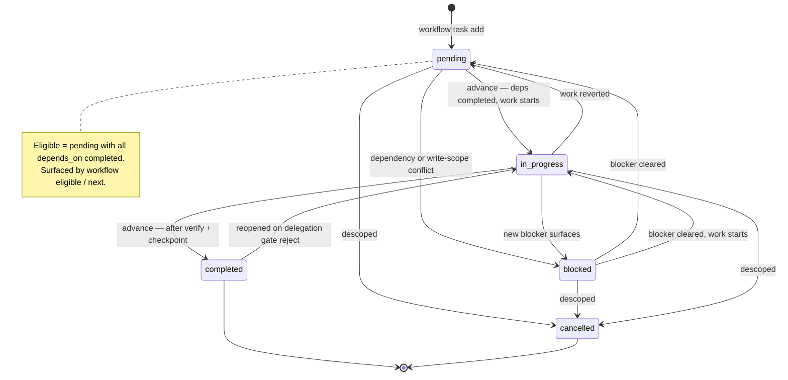
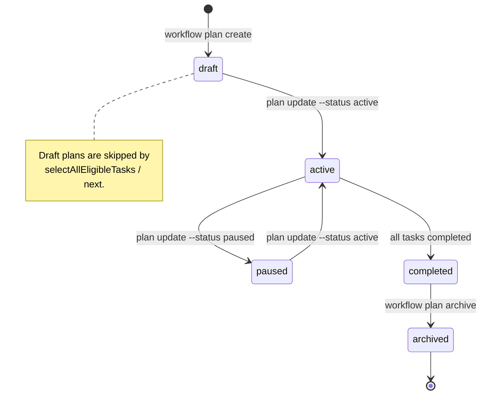

# Project Diagrams

These diagrams are derived from the current repo docs and code structure, primarily:

- `README.md`
- `docs/WORKFLOW_AUTOMATION_PRODUCT_SPEC.md`
- `docs/LOOP_ORCHESTRATION_SPEC.md`
- `docs/PLUGIN_CONTRACT.md`
- `docs/CANONICAL_HOOKS_DESIGN.md`
- `commands/root.go`
- `internal/platform/`

Use the first diagram when you want to explain the product in a demo. Use the second when you want to explain how the current codebase is organized.

## 1. Demo Diagram: How dot-agents works

```mermaid
flowchart LR
    H[Human or agent operator]
    A["Canonical home in ~/.agents/<br/>rules, skills, agents, hooks,<br/>settings, MCP, plugins"]
    M["Repo manifest<br/>.agentsrc.json"]
    C["dot-agents CLI<br/>init, add, install, refresh,<br/>status, doctor, workflow, review"]
    P["Planning and projection layer<br/>platform adapters + shared target planner"]
    R["Repo-local outputs<br/>AGENTS.md, CLAUDE.md, .cursor/,<br/>.codex/, .github/, .agents/ mirrors"]
    T["AI platforms<br/>Cursor, Claude Code, Codex,<br/>OpenCode, GitHub Copilot"]
    W["Workflow state<br/>repo .agents/ + ~/.agents/context<br/>+ ~/.agents/proposals"]

    H --> A
    H --> M
    A --> C
    M --> C
    C --> P
    P --> R
    R --> T
    T --> W
    C --> W
    W --> H
```

### Talk track

- `dot-agents` keeps one canonical source of truth in `~/.agents/` instead of hand-managing each platform separately.
- A repo-level `.agentsrc.json` declares what a project needs.
- The CLI reads canonical resources plus the manifest, plans the right outputs per platform, and projects them into the repo with links or rendered files.
- The AI tools consume those repo-local files natively.
- The workflow layer feeds context back through repo-local `.agents/` artifacts and user-local checkpoints and proposals.

## 2. Current Architecture Diagram

```mermaid
flowchart TB
    main["cmd/da/main.go<br/>Cobra entrypoint"]
    root["commands/root.go<br/>global flags + command registration"]

    subgraph Commands["commands/"]
        core["Project lifecycle<br/>init, add, remove, refresh, import, install"]
        ops["Inspection and ops<br/>status, doctor, explain, sync, session"]
        wf["Workflow and review<br/>workflow, review, kg"]
        authoring["Resource authoring<br/>skills, agents, hooks, rules, mcp, settings"]
    end

    subgraph Services["internal/"]
        cfg["config<br/>~/.agents config, .agentsrc.json,<br/>paths, proposal metadata"]
        plat["platform<br/>platform adapters, resource intents,<br/>shared target plans, renderers"]
        links["links<br/>symlink and hard-link helpers"]
        fsops["fsops<br/>OS-aware filesystem operations"]
        ps["projectsync<br/>repo scaffolding, restore helpers,<br/>refresh metadata"]
        scaffold["scaffold<br/>canonical scaffold assets<br/>home, hooks, templates"]
        gstore["graphstore<br/>KG/CRG storage and MCP surfaces"]
        ui["ui<br/>terminal formatting and prompts"]
    end

    subgraph State["Filesystem and state"]
        home["~/.agents/<br/>canonical user-level storage"]
        repo["Managed repo outputs<br/>AGENTS.md, CLAUDE.md, .cursor/,<br/>.codex/, .github/, .opencode/"]
        wfstate["Repo workflow artifacts<br/>.agents/active, .agents/history,<br/>.agents/lessons, workflow plans"]
        kg["Graph state<br/>.code-review-graph and graph backends"]
    end

    main --> root
    root --> core
    root --> ops
    root --> wf
    root --> authoring

    core --> cfg
    core --> plat
    core --> ps
    core --> scaffold

    ops --> cfg
    ops --> plat
    ops --> ui

    wf --> cfg
    wf --> gstore
    wf --> ui

    authoring --> cfg
    authoring --> plat
    authoring --> scaffold

    plat --> links
    links --> fsops
    cfg --> home
    plat --> repo
    ps --> repo
    wf --> wfstate
    gstore --> kg
```

### Reading notes

- The CLI entrypoint is thin: `cmd/da/main.go` hands off to Cobra commands in `commands/`.
- `commands/` is the orchestration layer; most reusable behavior lives in `internal/`.
- `internal/platform` is the key projection layer. It knows platform adapters, shared-target intents, and how repo-local outputs get created.
- `internal/config` owns the user-level and repo-level configuration contracts.
- Workflow and knowledge-graph features are layered beside the core config-management path, not bolted into a separate binary.
- The command layer is decomposed into per-feature subpackages (`commands/workflow`, `commands/agents`, `commands/skills`, `commands/sync`, `commands/kg`, `commands/hooks`), with shared helpers in `commands/internal/cmdutil`.
- Test-infrastructure packages (`internal/globalflagcov`, `internal/linktest`, `internal/testutil`) and the auxiliary `cmd/globalflag-coverage` binary are omitted here for clarity.

## Practical use

- For a live demo, show diagram 1 first and narrate the operator story from left to right.
- For maintainers or contributors, switch to diagram 2 and explain the split between `commands/`, `internal/`, and filesystem state.
- If you need slide art later, these Mermaid blocks can be rendered directly in GitHub or copied into Mermaid Live and exported as SVG.

## 3. Slide-Friendly Demo Diagram

This version uses tighter labels and a cleaner presentation flow for demos.

```mermaid
flowchart LR
    subgraph S["Source of truth"]
        A["~/.agents"]
        M[".agentsrc.json"]
    end

    C["dot-agents"]
    R["Repo outputs"]
    P["AI platforms"]
    W["Workflow memory"]

    A --> C
    M --> C
    C --> R
    R --> P
    P --> W
    W -. feedback .-> C
```

### Presenter note

- `~/.agents` is the shared source of truth.
- `.agentsrc.json` tells each repo what to install.
- `dot-agents` projects that into repo-native files.
- The platforms use those files directly.
- Workflow memory closes the loop so the next session starts with context instead of guesswork.

## 4. Slide-Friendly Current Architecture Diagram

This version is intended for architecture slides where the audience only needs the major layers.

```mermaid
flowchart LR
    E["CLI entrypoint"]
    C["Command layer"]
    P["Projection layer"]
    S["Shared services"]
    F["Files and state"]

    E --> C
    C --> P
    C --> S
    P --> F
    S --> F
```

### Presenter note

- The binary entrypoint is thin.
- The command layer handles user-facing workflows.
- The projection layer turns canonical resources into platform-specific repo outputs.
- Shared services handle config, links, hooks, graph access, and project sync.
- Everything ultimately resolves into filesystem state that the tools and agents consume.

## 5. Workflow Engine Diagram

Derived from `commands/workflow/` (`cmd.go`, `types.go`, `plan_task.go`, `state.go`,
`delegation.go`, `bundle.go`, `iter_log.go`) and the workflow-artifact-model rule.
This shows the artifact lifecycle and the `da workflow` command surface that drives it.

```mermaid
flowchart TD
    idea([Idea])

    subgraph AUTHOR["1 - Authoring tier"]
        spec["Spec<br/>workflow/specs/&lt;id&gt;/design.md<br/>what & why, decisions, open questions"]
        plan["Plan — workflow plan create / update<br/>PLAN.yaml + &lt;id&gt;.plan.md<br/>how & in what order"]
        tasks["Tasks — workflow task add / update<br/>TASKS.yaml — work queue<br/>depends_on, write_scope, app_type"]
        slices["Slices (optional)<br/>SLICES.yaml — bounded sub-units"]
    end

    subgraph SELECT["2 - Selection"]
        schedule["workflow schedule<br/>Kahn BFS topological waves"]
        eligible["workflow eligible<br/>unblocked tasks + write-scope conflict detection"]
        next["workflow next<br/>suggest next actionable task"]
        decide{"Direct or<br/>fanout?"}
    end

    subgraph DIRECT["3a - Direct execution"]
        impl_d["Implement in write_scope"]
    end

    subgraph FANOUT["3b - Delegated execution"]
        fanout["workflow fanout<br/>emit delegation bundle YAML"]
        bundle["workflow bundle stages<br/>expand to ordered stages"]
        stages["Staged runtime<br/>impl -> verifier(s) -> review"]
        mergeback["workflow merge-back<br/>record sub-agent result + merge-back.md"]
        gate["workflow delegation gate<br/>accept / reject / escalate"]
        closeout["workflow delegation closeout<br/>archive merge-back, reconcile task"]
    end

    subgraph CLOSE["4 - Iteration close & persistence"]
        verify["workflow verify record<br/>verification-log.jsonl"]
        checkpoint["workflow checkpoint<br/>checkpoint log + iter-log/iter-N.yaml"]
        advance["workflow advance<br/>pending -> in_progress -> completed"]
    end

    archive["workflow plan archive<br/>history/&lt;id&gt;/ — PLAN + TASKS + plan.md + merge-backs"]
    done([Permanent record])

    idea --> spec --> plan --> tasks --> slices
    tasks --> schedule --> eligible --> next --> decide
    decide -->|direct| impl_d
    decide -->|fanout| fanout
    fanout --> bundle --> stages --> mergeback --> gate
    gate -->|accept| closeout
    gate -->|reject / escalate| stages
    impl_d --> verify
    closeout --> verify
    verify --> checkpoint --> advance
    advance -->|more tasks| next
    advance -->|all completed| archive --> done

    subgraph CROSS["Cross-cutting subsystems"]
        kg["workflow graph query / health<br/>KG bridge — scope evidence, readback"]
        driftsweep["workflow drift / sweep<br/>cross-repo drift detection + fixes"]
        foldback["workflow fold-back<br/>route loop observations to plans / proposals"]
        prefs["workflow prefs<br/>resolved local + shared preferences"]
        orient["workflow orient / status / health<br/>session context + health snapshot"]
    end

    kg -.scope evidence.-> tasks
    kg -.readback.-> decide
    prefs -.policy.-> decide
    foldback -.observations.-> plan
    orient -.state.-> next
    driftsweep -.guards.-> tasks
```

### Reading notes

- **Four artifact tiers** (spec -> plan -> tasks -> history) — each box names the CLI
  verb that produces or mutates that artifact.
- **Fanout path** is the delegation lifecycle: `fanout` emits a bundle YAML, `bundle
  stages` expands it into the `impl -> verifier(s) -> review` staged runtime, then
  `merge-back` -> `delegation gate` -> `closeout`. A rejected gate loops back.
- **Iteration close** (`verify -> checkpoint -> advance`) is the shared tail — direct
  work runs `advance`, delegated work runs `merge-back` first.
- **Cross-cutting subsystems** feed the core loop rather than sitting on the critical path.

## 6. Workflow State Diagram

Derived from `isValidTaskStatus` / `isValidPlanStatus` and `runWorkflowAdvance` in
`commands/workflow/plan_task.go`. Status transitions are driven by `da workflow advance`
(tasks) and `da workflow plan update --status` / `plan archive` (plans).

### Task status machine

```mermaid
stateDiagram-v2
    [*] --> pending: workflow task add

    pending --> in_progress: advance — deps completed, work starts
    pending --> blocked: dependency or write-scope conflict
    pending --> cancelled: descoped

    blocked --> pending: blocker cleared
    blocked --> in_progress: blocker cleared, work starts
    blocked --> cancelled: descoped

    in_progress --> completed: advance — after verify + checkpoint
    in_progress --> blocked: new blocker surfaces
    in_progress --> pending: work reverted
    in_progress --> cancelled: descoped

    completed --> in_progress: reopened on delegation gate reject

    completed --> [*]
    cancelled --> [*]

    note right of pending
        Eligible = pending with all depends_on completed.
        Surfaced by workflow eligible / next.
    end note
```

### Plan status machine

```mermaid
stateDiagram-v2
    [*] --> draft: workflow plan create

    draft --> active: plan update --status active
    active --> paused: plan update --status paused
    paused --> active: plan update --status active
    active --> completed: all tasks completed
    completed --> archived: workflow plan archive
    archived --> [*]

    note right of draft
        Draft plans are skipped by
        selectAllEligibleTasks / next.
    end note
```

### Reading notes

- **Task verbs:** every task transition goes through `da workflow advance`; valid values
  are `pending`, `in_progress`, `blocked`, `completed`, `cancelled`.
- **Eligibility** is not a status — it is a derived view: a `pending` task whose
  `depends_on` are all `completed`.
- **Reopen edge:** `completed -> in_progress` happens when a delegation gate rejects a
  merge-back, sending the task back through the staged runtime.
- **Plan verbs:** plans move via `plan update --status` (`draft`, `active`, `paused`,
  `completed`, `archived`); `plan archive` performs the final `completed -> archived`
  step and bundles the history record.
